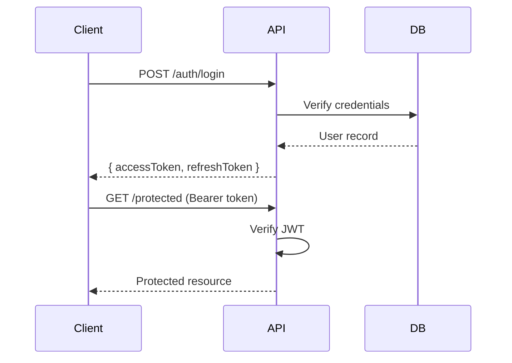

# Implementation Plan: User Authentication

## Summary

Add JWT-based authentication to the API server with login, registration, and token refresh endpoints.

## Technical Context

- **Language:** TypeScript 5.x
- **Framework:** Express 5
- **Storage:** PostgreSQL with Prisma ORM
- **Testing:** Vitest + Supertest

## Requirements

### Functional Requirements

- **FR-001:** Users can register with email and password
- **FR-002:** Users can log in and receive a JWT access token + refresh token
- **FR-003:** Protected endpoints reject requests without valid tokens
- **FR-004:** Refresh tokens can be used to obtain new access tokens

### Non-Functional Requirements

- Passwords must be hashed with bcrypt (cost factor 12)
- Access tokens expire after 15 minutes
- Refresh tokens expire after 7 days

## Architecture

## Data Model

| Field | Type | Constraints |
|-------|------|-------------|
| id | UUID | Primary key |
| email | String | Unique, indexed |
| passwordHash | String | Not null |
| createdAt | DateTime | Default now |
| updatedAt | DateTime | Auto-update |

## Implementation Steps

1. Set up Prisma schema with User model
2. Create auth middleware for JWT verification
3. Implement registration endpoint with validation
4. Implement login endpoint with bcrypt comparison
5. Add refresh token rotation logic
6. Write integration tests for all endpoints

> **Note:** Consider rate limiting on auth endpoints to prevent brute force attacks.
